# Трип по Прибалтике: Варшава → Литва → Латвия → Эстония → обратно

**Даты:** 25 апреля — 3 мая (9 дней)  
**Страны:** Польша, Литва, Латвия, Эстония  
**Старт/финиш:** Варшава  
**Ориентировочный пробег:** ~2 800 км

---

## День 1 — 25 апреля. Варшава → Каунас → Клайпеда

**Выезд в 8:00.**

### Переезды

| Откуда | Куда | Расстояние | Время |
|--------|------|------------|-------|
| Варшава | Каунас | 398 км | 4 ч 20 мин |
| Каунас | Клайпеда | 213 км | 2 ч 15 мин |

### Места

**Каунас — Laisvės alėja и старый город**  
Главный пешеходный проспект Литвы и исторический центр: костёлы, ратуша, дома в стиле модерн. Обед и прогулка после приезда.

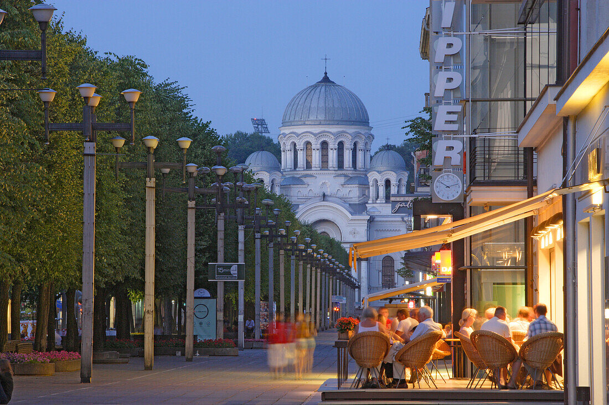
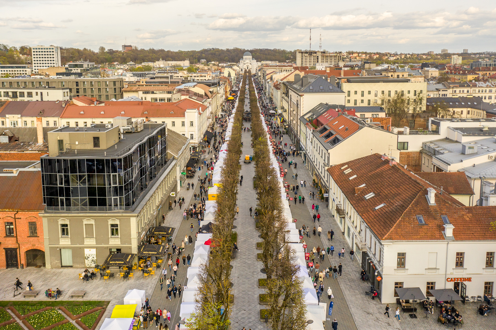

**Клайпеда — старый город и набережная**  
Вечер в портовом городе: уютный старый город с фахверком и деревянной скульптурой, набережная реки Дане. Ночуем в Клайпеде (1-я ночь).

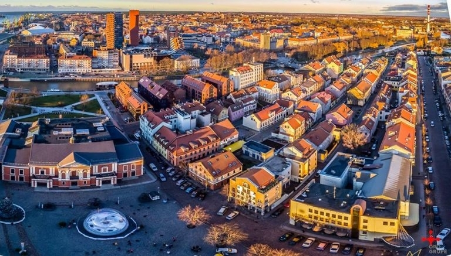
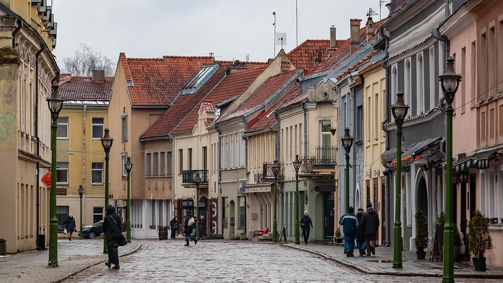

---

## День 2 — 26 апреля. Куршская коса и Морской музей

База в Клайпеде, без длинных переездов.

### Места

**Куршская коса (Коса)**  
Узкая полоса песка между Куршским заливом и Балтикой: дюны, сосновые леса, рыбацкие посёлки. Парк включён в список ЮНЕСКО.

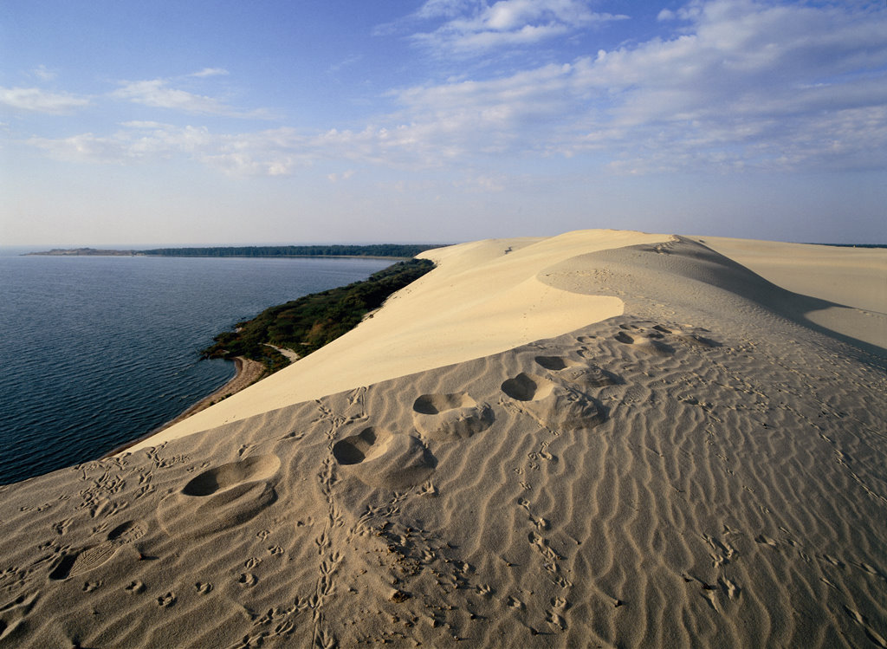
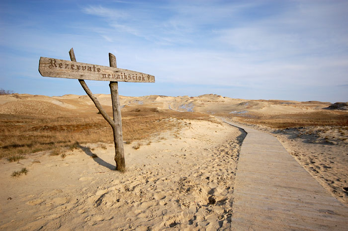

**Lithuanian Sea Museum (Морской музей Литвы)**  
Музей в крепости Копгалис на косе: история мореплавания, аквариумы, дельфинарий. Отличный вариант на полдня.

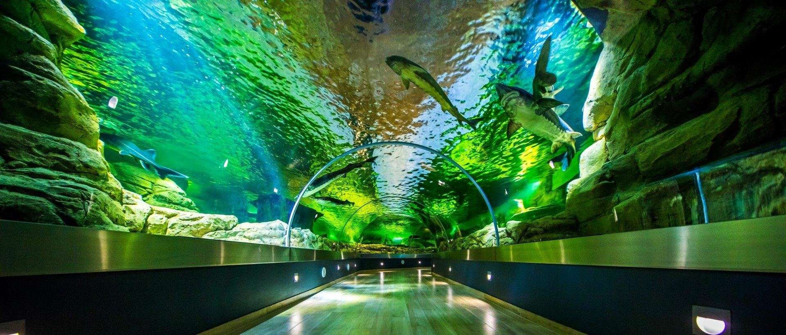

**Ночуем в Клайпеде (2-я ночь).**

---

## День 3 — 27 апреля. Музей холодной войны, Холм крестов, Рига

### Переезды

| Откуда | Куда | Расстояние | Время |
|--------|------|------------|-------|
| Клайпеда | Cold War Museum (Платяляй) | 145 км | 1 ч 40 мин |
| Cold War Museum | Hill of Crosses (Шяуляй) | 135 км | 1 ч 30 мин |
| Hill of Crosses | Рига | 185 км | 2 ч |

### Места

**Cold War Museum (Плокштине)**  
Бывшая советская подземная ракетная база в лесу у Платяляй: шахты, командный пункт, экспозиция о ядерном противостоянии. Уникальный объект в Прибалтике.

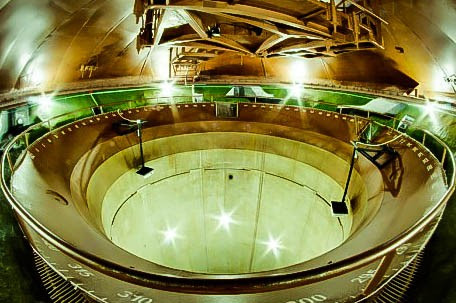

**Hill of Crosses (Крестовый холм)**  
Холм под Шяуляем с тысячами крестов — символ веры и памяти. Традиция с XIX века; место паломничества и туризма.

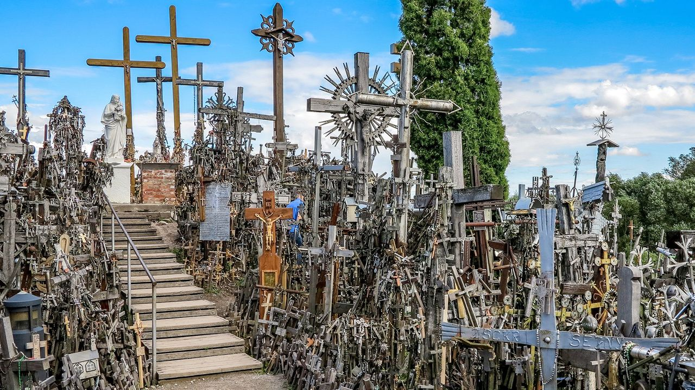
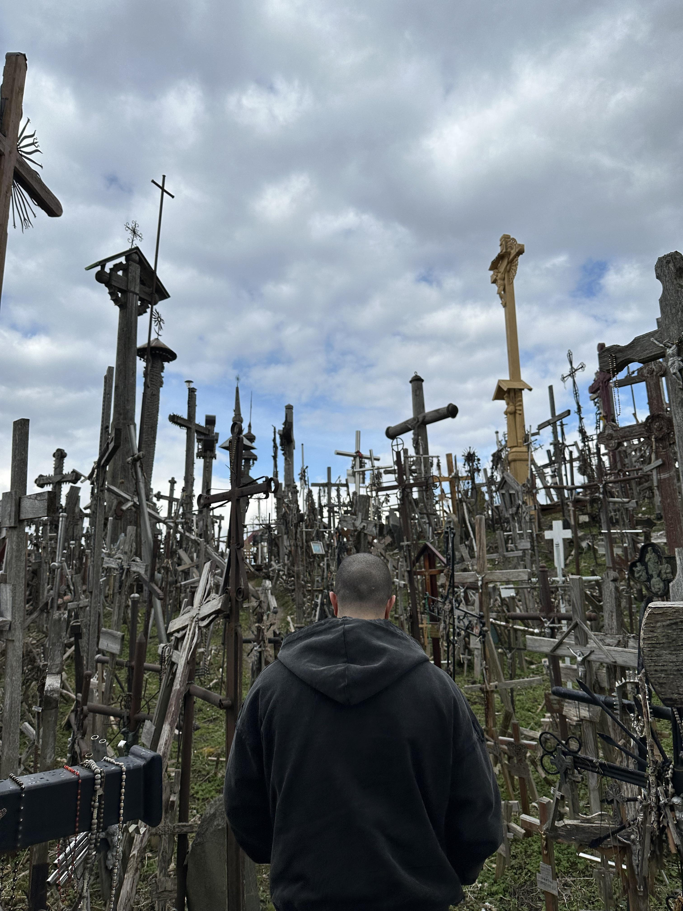

**Ночуем в Риге.**

---

## День 4 — 28 апреля. Рига → Сигулда (долина Гауи) → Выру

### Переезды

| Откуда | Куда | Расстояние | Время |
|--------|------|------------|-------|
| Рига | Сигулда | 52 км | ~1 ч |
| Сигулда / район | Выру | 230 км | 2 ч 30 мин |

### Места

**Emperor's Chair (Ķeizarkrēsls)**  
Видовая точка на левом берегу Гауи в Сигулде: большая деревянная «кресло» на обрыве, вид на долину и замок Турайда. Появилось после визита Александра II в 1862 году.

**Castle of the Livonian Order in Sigulda (Замок Сигулды)**  
Руины замка Ливонского ордена XIII века над долиной Гауи. Осмотр снаружи и панорамы.

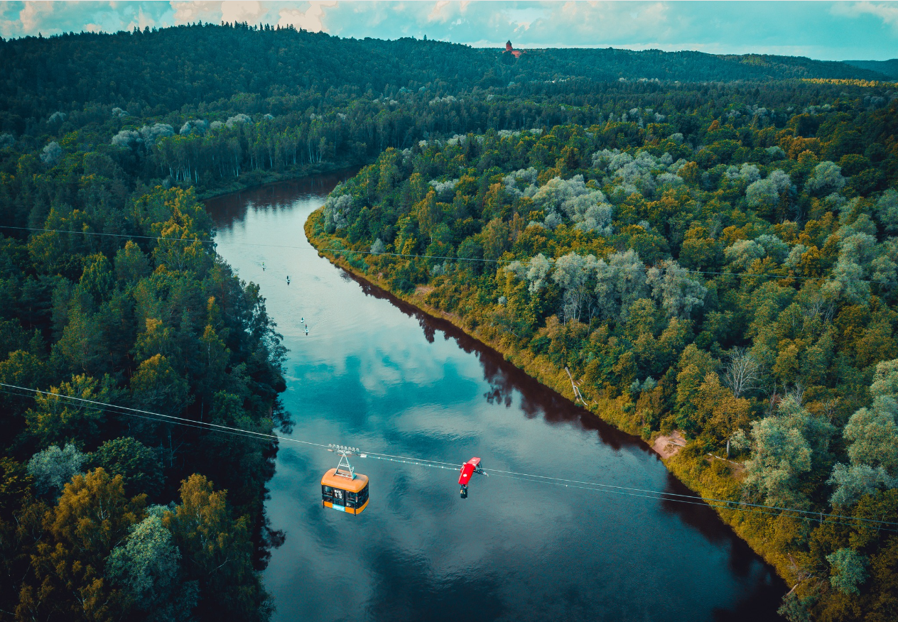

**Gutman's Cave (Пещера Гутмана)**  
Самая большая пещера в Балтии, в парке Турайда. Связана с легендами и надписями на стенах с XIX века.

**Turaida Castle (Замок Турайда)**  
Восстановленный замок-музей в красном кирпиче — символ долины Гауи. С башни открывается вид на окрестности.

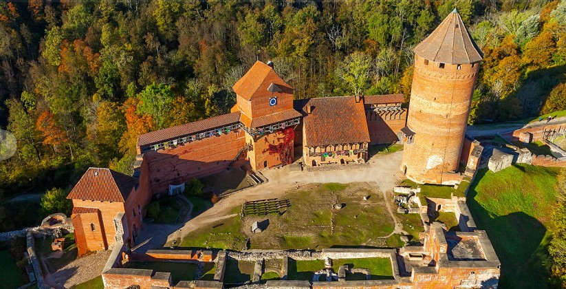
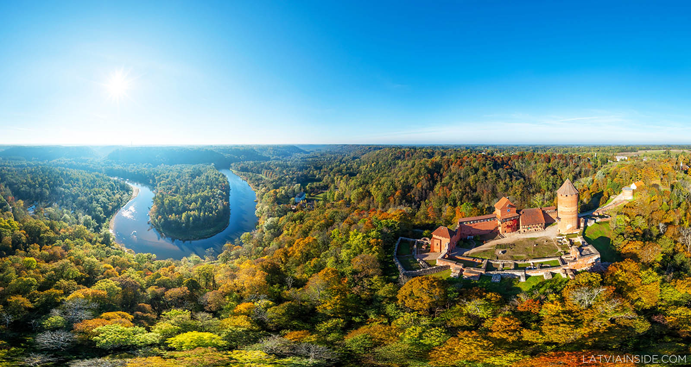

**Paradise Hill (Райская гора)**  
Смотровая точка в окрестностях Сигулды с видом на долину и замки.

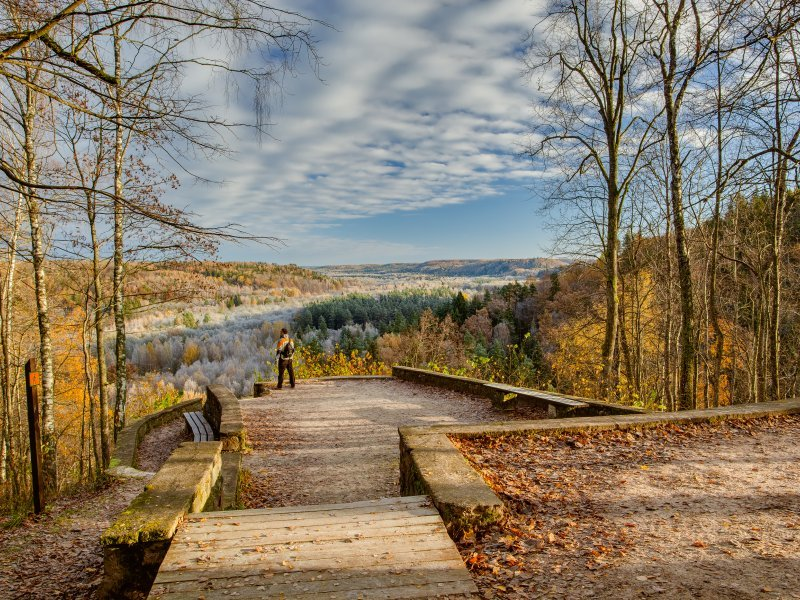

Максимально поздний выезд в Выру. **Ночуем в Выру.**

---

## День 5 — 29 апреля. Выру, пещеры Пийуза, Таллинн

### Переезды

| Откуда | Куда | Расстояние | Время |
|--------|------|------------|-------|
| Выру | Piusa Cave Museum | 28 км | ~30 мин |
| Выру | Таллинн | 248 км | 3 ч 20 мин |

### Места

**Выру — дом / роддом**  
Личные точки в Выру (родной город/роддом) — осмотр по желанию.

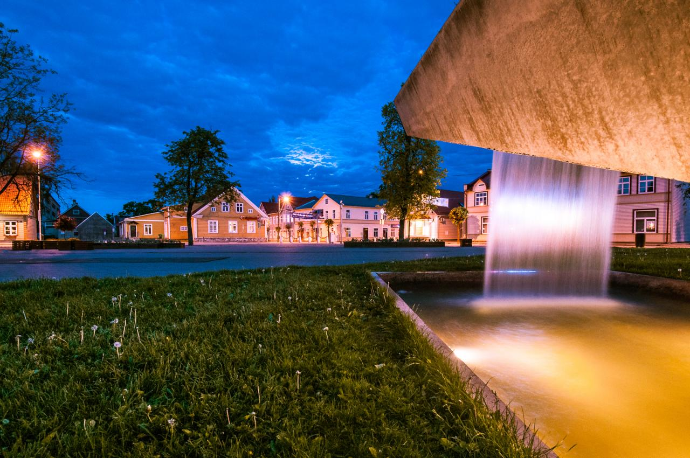

**Piusa Cave Museum (Пещеры Пийуза)**  
Песчаниковые пещеры, созданные ручной добычей стекольного песка с XIX века. Подземные ходы и музей истории добычи.

**Таллинн — прогулка по старому городу**  
Приезд вечером, прогулка по Старому городу: Ратушная площадь, башни, улочки. **Ночуем в Таллинне.**

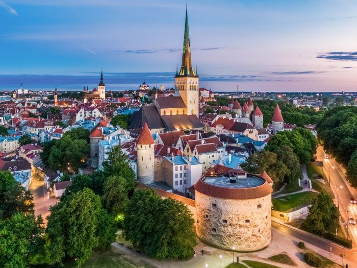
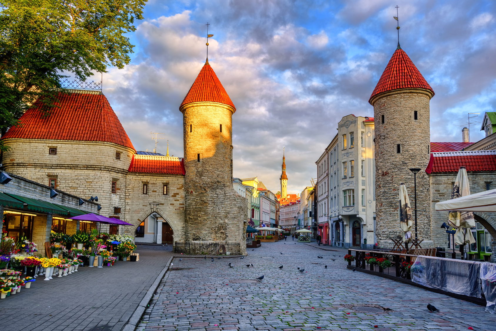

---

## День 6 — 30 апреля. Таллинн: Lennusadam, Ягала, болото Виру, Раквере

Выезды из Таллинна и возврат; без ночёвки в другом городе.

### Места

**Lennusadam (Морской музей — гавань гидросамолётов)**  
Филиал Эстонского морского музея в ангаре для гидросамолётов (1910-е). Подлодка «Лембит», ледокол «Суур Тылль», симуляторы и экспозиции про море и авиацию.

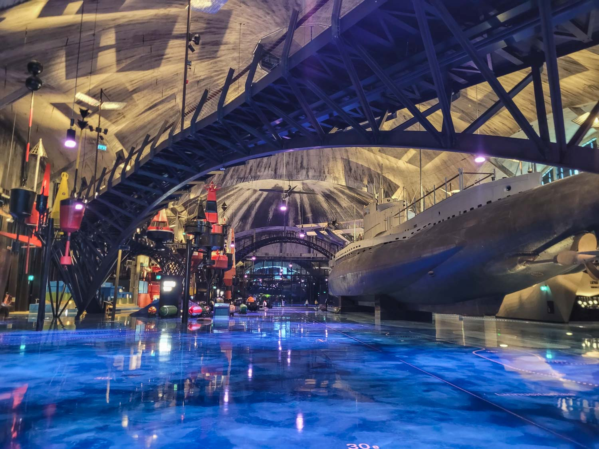

**Jägala Waterfall (Водопад Ягала)**  
Широкий природный водопад на реке Ягала в 20 с лишним км от Таллинна. Особенно красив после таяния снега и дождей.

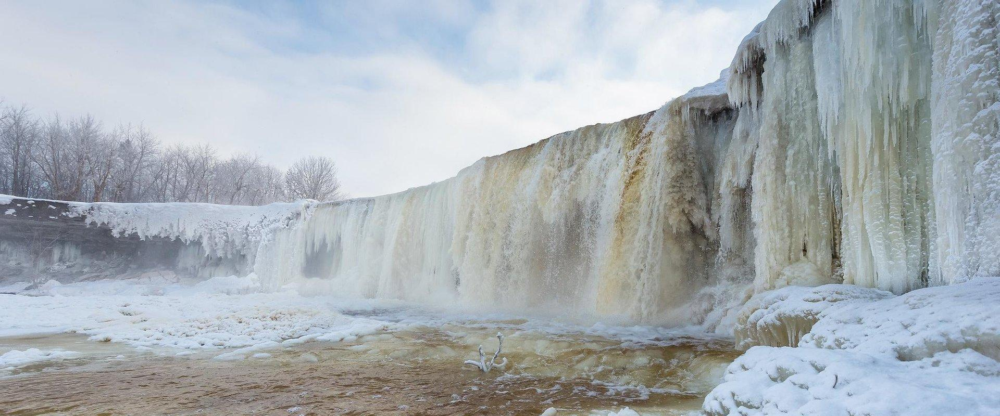

**Viru bog nature trail (Тропа по болоту Виру)**  
Деревянная тропа по верховому болоту в Лахемаа: безопасный хайкинг, типичная природа Эстонии.

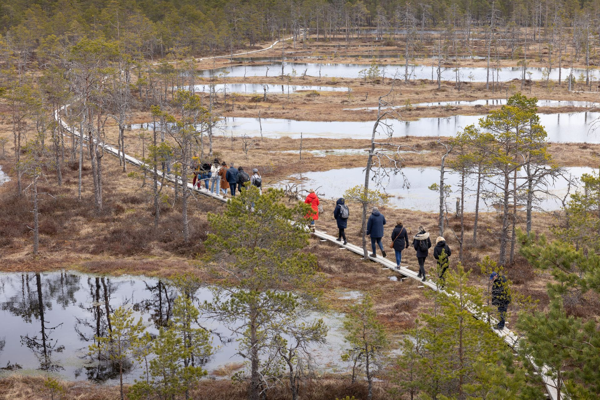
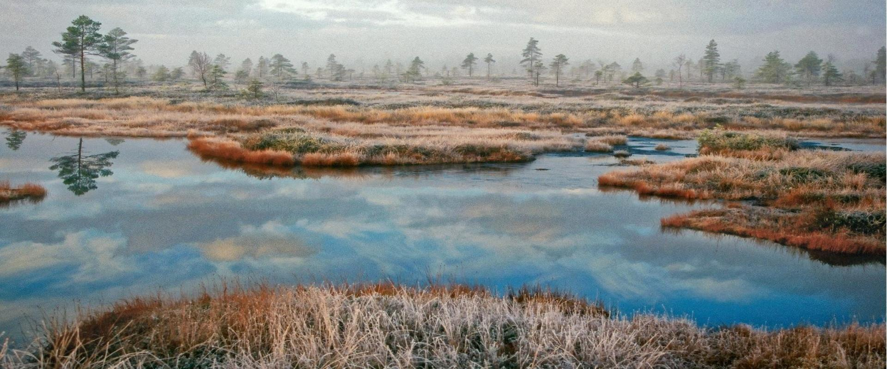

**Rakvere Linnus (Замок Раквере)**  
Развалины замка и музей в Раквере: средневековая атмосфера, реконструкции, вид на город.

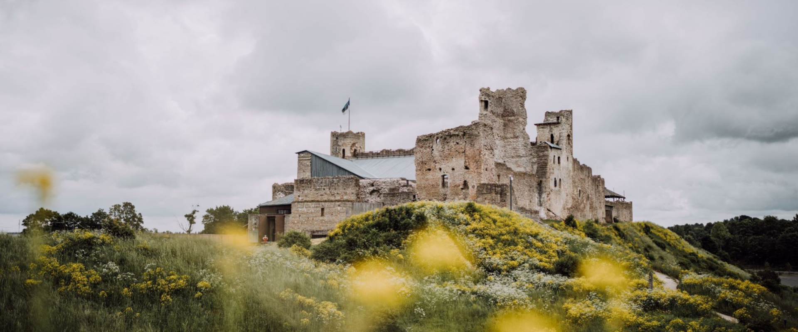

**Ночуем в Таллинне.**

---

## День 7 — 1 мая. KUMU, Румпу, маяк Пакри, ÖÖD Lohusalu

### Места

**Estonian Art Museum — KUMU (Художественный музей Эстонии)**  
Главный музей искусства в Таллинне (Кадриорг): эстонское искусство с XVIII века до наших дней, временные выставки. Здание — современная архитектура.

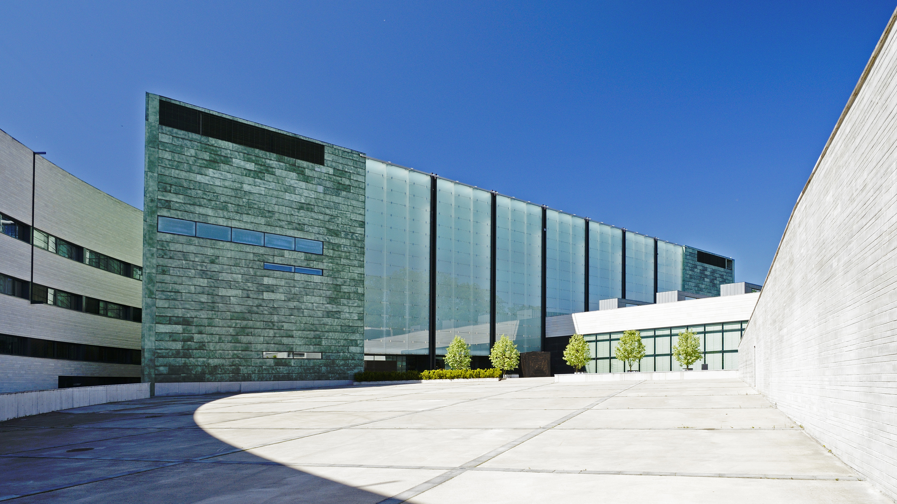

**Rummu (затопленная тюрьма и карьер)**  
Бывший известняковый карьер и лагерь: после остановки откачки вода затопила постройки — получилось бирюзовое озеро с руинами под водой. Купание, дайвинг, фото.

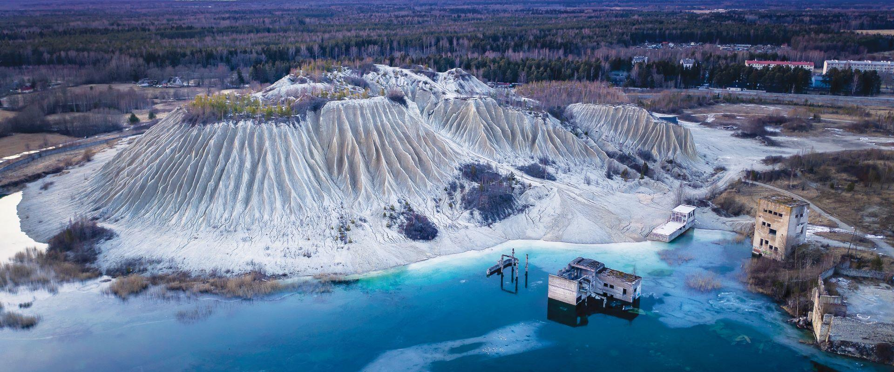
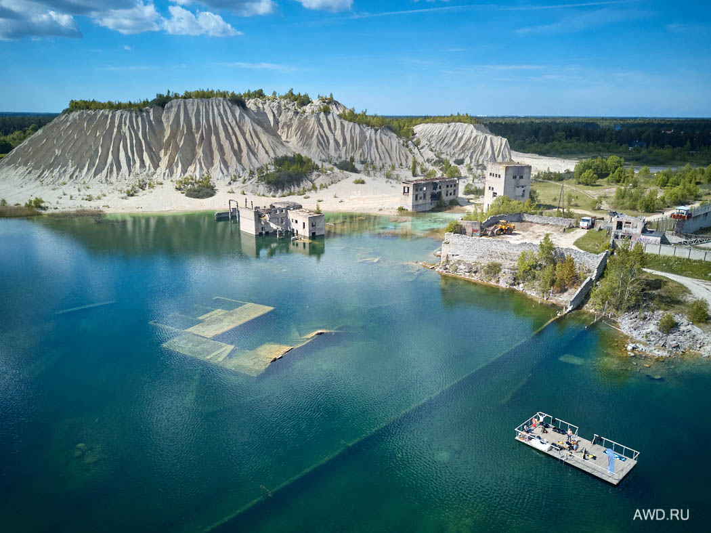

**Pakri Lighthouse (Маяк Пакри)**  
Маяк на полуострове Пакри на северо-западе Эстонии. Море, скалы, атмосфера балтийского побережья.

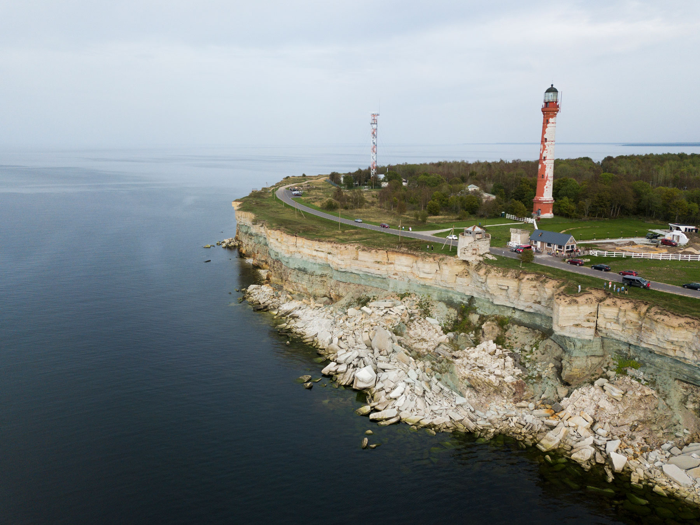

**ÖÖD Lohusalu**  
Ночлег в стеклянном домике у моря в Лохусалу — необычное размещение с видом на природу.

---

## День 8 — 2 мая. Таллинн → Спа Wagenküll → Бауска

### Переезды

| Откуда | Куда | Расстояние | Время |
|--------|------|------------|-------|
| Таллинн | Lossispaa Wagenküll (Спа) | 210 км | 2 ч 30 мин |
| Wagenküll (Спа) | Бауска | 310 км | 3 ч 30 мин |

### Места

**Lossispaa Wagenküll**  
Замковый спа-отель в Южной Эстонии: бассейны, сауны, отдых. Дневная остановка по пути в Латвию.

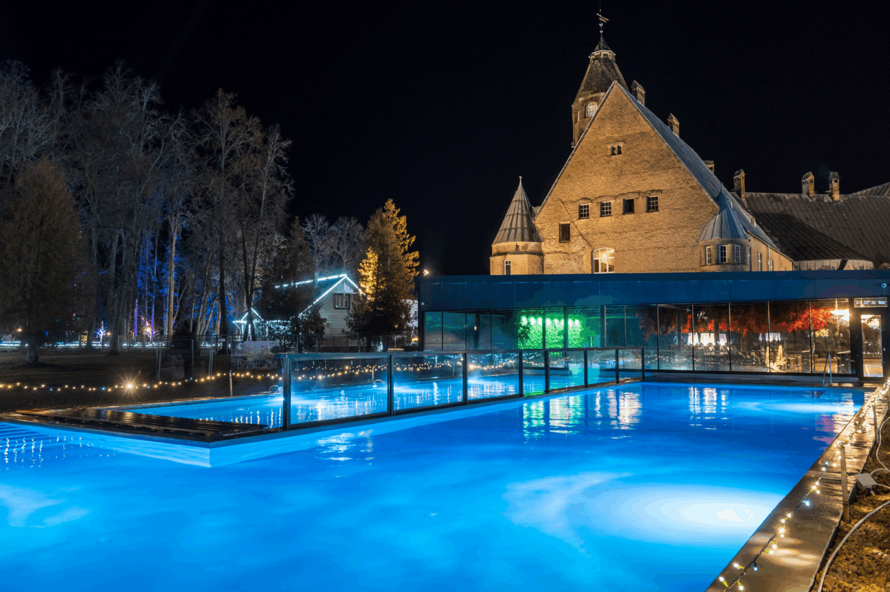

**Бауска**  
Город на границе с Литвой, вечерняя прогулка. **Ночуем в Бауске.**

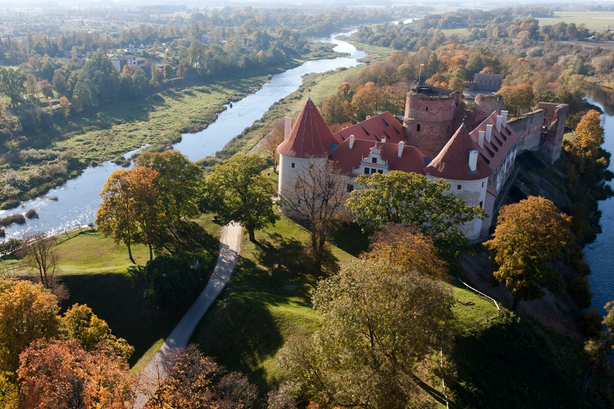

---

## День 9 — 3 мая. Дворец Рундале, Каунас, Варшава

### Переезды

| Откуда | Куда | Расстояние | Время |
|--------|------|------------|-------|
| Бауска | Rundāle Palace Museum | 12 км | ~15 мин |
| Rundāle Palace | Каунас | 240 км | 2 ч 40 мин |
| Каунас | Варшава | 398 км | 4 ч 20 мин |

### Места

**Rundāle Palace Museum (Дворец Рундале)**  
Барочный дворец по проекту Растрелли: парадные залы, парк, одна из главных достопримечательностей Латвии. Посещение утром.

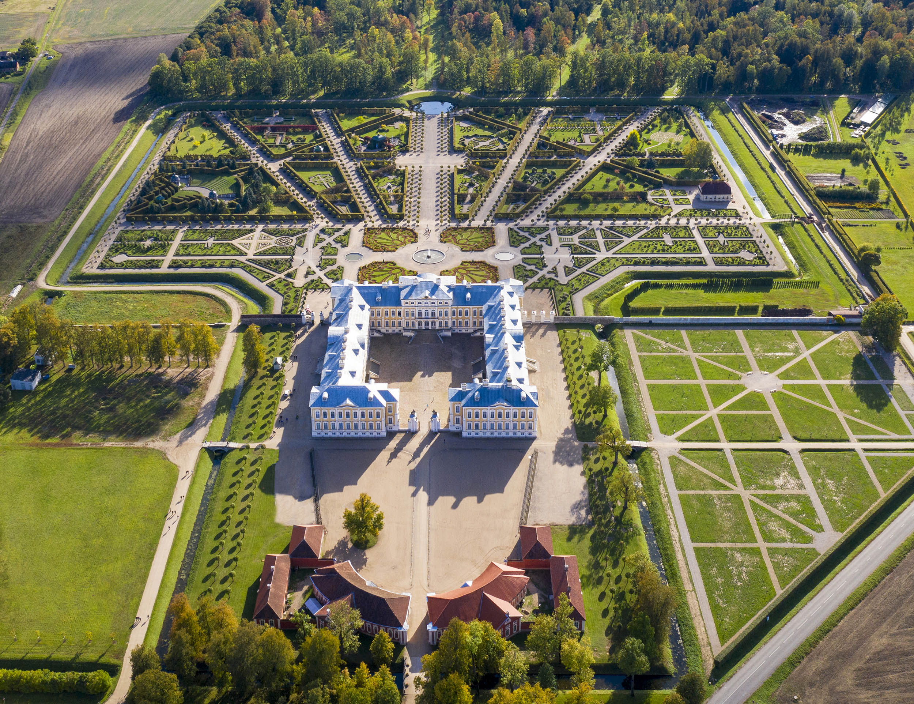
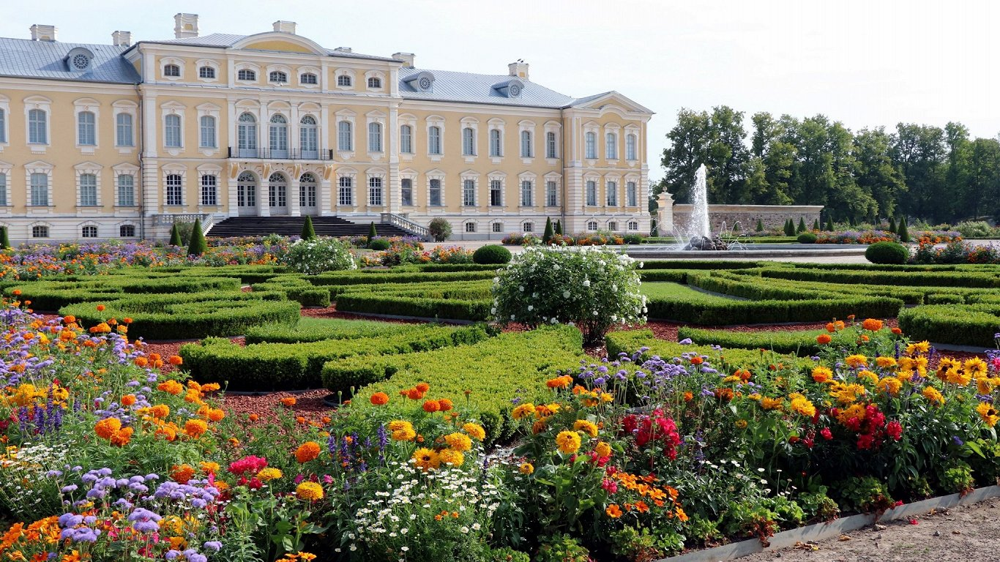

Далее переезд в Каунас (при необходимости — короткая остановка) и возврат в Варшаву.

---

## Саммари пробега

| № | Маршрут | км |
|---|---------|-----|
| 1 | Варшава → Каунас | 398 |
| 2 | Каунас → Клайпеда | 213 |
| 3 | Клайпеда → Cold War Museum | 145 |
| 4 | Cold War Museum → Hill of Crosses | 135 |
| 5 | Hill of Crosses → Рига | 185 |
| 6 | Рига → Сигулда | 52 |
| 7 | Сигулда / район → Выру | 230 |
| 8 | Выру → Piusa Cave Museum | 28 |
| 9 | Выру → Таллинн | 248 |
| 10 | Таллинн → Lossispaa Wagenküll | 210 |
| 11 | Wagenküll → Бауска | 310 |
| 12 | Бауска → Rundāle Palace | 12 |
| 13 | Rundāle Palace → Каунас | 240 |
| 14 | Каунас → Варшава | 398 |

**Всего проехать: ~2 804 км** (без учёта локальных поездок в дни 2, 6, 7).

---

## Карта поездки по дням

На карте показано движение по маршруту от точки к точке по дням: День 1 (Варшава → Каунас → Клайпеда), День 2 (Клайпеда, коса), День 3 (в Ригу), День 4 (Сигулда → Выру), День 5 (Выру → Таллинн), Дни 6–7 (Таллинн и окрестности), День 8 (Спа → Бауска), День 9 (Рундале → Каунас → Варшава).

